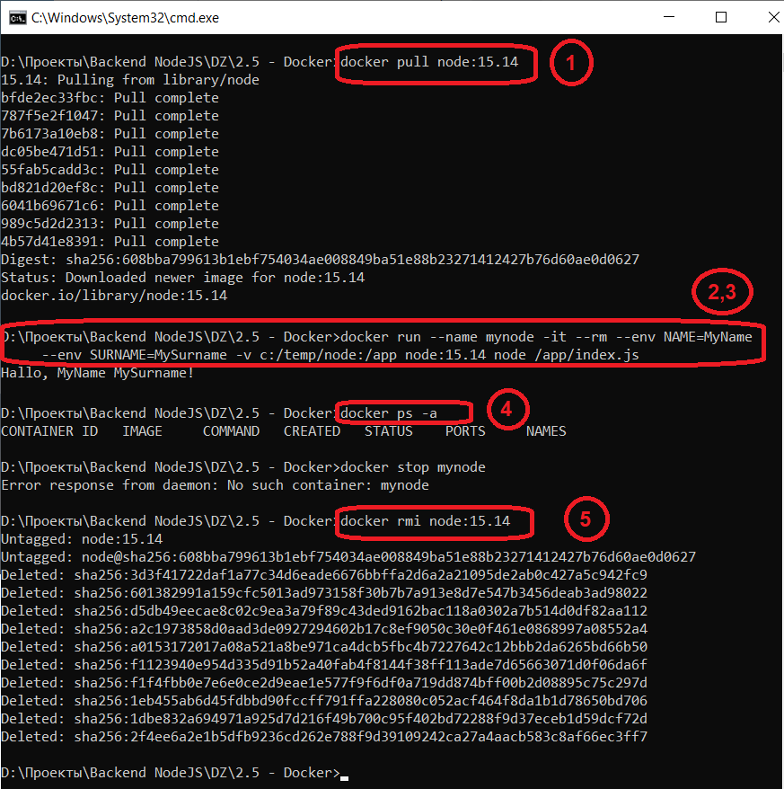

# docker

## Задание 2

1. Загрузите образ node версии 15.14

`docker pull node:15.14`

2. Запустите контейнер node в интерактивном режиме подключения терминала, поименуйте его mynode, передайте две переменные среды NAME=<ваше имя> и SURNAME=<ваша фамилия>

В интеркатикном не получилось, зато получилось запустить сценарий из [файла](index.js) на хостовой машине
```
docker run --name mynode -it --rm --env NAME=MyName --env SURNAME=MySurname -v c:/temp/node:/app node:15.14 node /app/index.js
```
3. В интерактивной среде выполнения node выполните скрипт, который выведет на экран приветсвтие: Привет, <ваше имя> <ваша фамилия>!, эти данные должны быть получены из переменных среды
```
docker run --name mynode -it --rm --env NAME=MyName --env SURNAME=MySurname -v c:/temp/node:/app node:15.14 node /app/index.js
Hallo, MyName MySurname!
```
4. Остановите контейнер

Контейнер автоматически удалился после завершения
```
docker ps -a
CONTAINER ID   IMAGE     COMMAND   CREATED   STATUS    PORTS     NAMES

```

5. Удалите образ node версии 15.14
```
docker rmi node:15.14
Untagged: node:15.14
Untagged: node@sha256:608bba799613b1ebf754034ae008849ba51e88b23271412427b76d60ae0d0627
Deleted: sha256:3d3f41722daf1a77c34d6eade6676bbffa2d6a2a21095de2ab0c427a5c942fc9
Deleted: sha256:601382991a159cfc5013ad973158f30b7b7a913e8d7e547b3456deab3ad98022
Deleted: sha256:d5db49eecae8c02c9ea3a79f89c43ded9162bac118a0302a7b514d0df82aa112
Deleted: sha256:a2c1973858d0aad3de0927294602b17c8ef9050c30e0f461e0868997a08552a4
Deleted: sha256:a0153172017a08a521a8be971ca4dcb5fbc4b7227642c12bbb2da6265bd66b50
Deleted: sha256:f1123940e954d335d91b52a40fab4f8144f38ff113ade7d65663071d0f06da6f
Deleted: sha256:f1f4fbb0e7e6e0ce2d9eae1e577f9f6df0a719dd874bff00b2d08895c75c297d
Deleted: sha256:1eb455ab6d45fdbbd90fccff791ffa228080c052acf464f8da1b1d78650bd706
Deleted: sha256:1dbe832a694971a925d7d216f49b700c95f402bd72288f9d37eceb1d59dcf72d
Deleted: sha256:2f4ee6a2e1b5dfb9236cd262e788f9d39109242ca27a4aacb583c8af66ec3ff7
```

