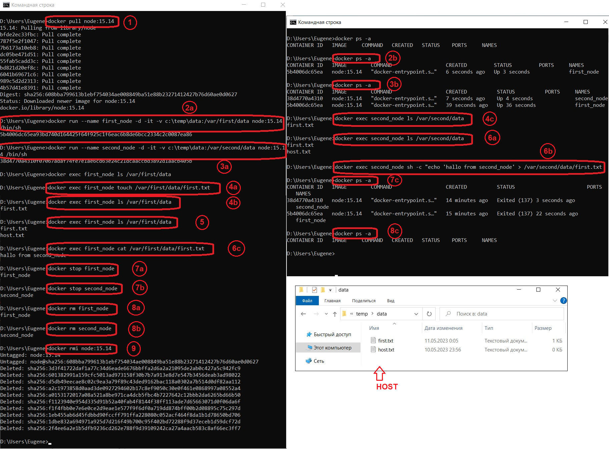

# docker

## Задание 3

1. Загрузите образ node версии 15.14

`docker pull node:15.14`

2. Запустите контейнер с именем _first_node_ из образа node версии 15.14 в фоновом режиме, подключив папку data из текущей директории в /var/first/data контейнера

`docker run --name first_node -d -it -v c:\temp\data:/var/first/data node:15.14 /bin/sh`

3. Запустите контейнер с именем _second_node_ из образа node версии 15.14 в фоновом режиме, подключив папку data из текущей директории в /var/second/data контейнера

`docker run --name second_node -d -it -v c:\temp\data:/var/second/data node:15.14 /bin/sh`

4. Подключитесь к контейнеру _first_node_ с помощью exec и создайте текстовый файл любого содержания в /var/first/data
  
    a) проверка сожержимого папки в контейнере _first_node_
    ```
    docker exec first_node ls /var/first/data

    ```
    b) создание пустого файла _first.txt_ в папке контейнера _first_node_

    `docker exec first_node touch /var/first/data/first.txt`

    c) проверка сожержимого папки в контейнере _first_node_
    ```
    docker exec first_node ls /var/first/data
      first.txt

    ```
5. Добавьте еще один файл в папку data на хостовой машине
```
docker exec first_node ls /var/first/data
  first.txt
  host.txt
```
6. Подключитесь к контейнеру _second_node_ с помощью exec и получите список файлов в директории /var/second/data, выведете на экран содержимое файлов

    a) проверка сожержимого папки в контейнере _second_node_
    ```
    docker exec second_node ls /var/second/data
      first.txt
      host.txt
    ```
    b) изменение содержимого файла _first.txt_ в контейнере  _second_node_

    `docker exec second_node sh -c "echo 'hallo from second_node' > /var/second/data/first.txt
  `

    c) проверка сожержимого файла _first.txt_ в контейнере _first_node_
    ```
    docker exec first_node cat /var/first/data/first.txt
      hallo from second_node
      
    ```
7. Остановите оба контейнера

    a) остановка контейнера _first_node_
    ```
    docker stop first_node
      first_node
      
    ```
    b) остановка контейнера _second_node_
    ```
    docker stop second_node
      second_node
      
    ```
    c) проверка корректности остановки контейнеров
    ```
    docker ps -a
      CONTAINER ID   IMAGE        COMMAND                  CREATED          STATUS                        PORTS     NAMES
      38d4770a4310   node:15.14   "docker-entrypoint.s…"   14 minutes ago   Exited (137) 3 seconds ago              second_node
      5b4006dc65ea   node:15.14   "docker-entrypoint.s…"   15 minutes ago   Exited (137) 22 seconds ago             first_node
    ```
8. Удалите оба контейнера

    a) удаление контейнера _first_node_
    ```
    docker rm first_node
      first_node
      
    ```
    b) удаление контейнера _second_node_
    ```
    docker rm second_node
      second_node
      
    ```
    c) проверка корректности удаления контейнеров
    ```
    docker ps -a
      CONTAINER ID   IMAGE     COMMAND   CREATED   STATUS    PORTS     NAMES
      
    ```
9. Удалите образ node версии 15.14
```
docker rmi node:15.14
Untagged: node:15.14
Untagged: node@sha256:608bba799613b1ebf754034ae008849ba51e88b23271412427b76d60ae0d0627
Deleted: sha256:3d3f41722daf1a77c34d6eade6676bbffa2d6a2a21095de2ab0c427a5c942fc9
Deleted: sha256:601382991a159cfc5013ad973158f30b7b7a913e8d7e547b3456deab3ad98022
Deleted: sha256:d5db49eecae8c02c9ea3a79f89c43ded9162bac118a0302a7b514d0df82aa112
Deleted: sha256:a2c1973858d0aad3de0927294602b17c8ef9050c30e0f461e0868997a08552a4
Deleted: sha256:a0153172017a08a521a8be971ca4dcb5fbc4b7227642c12bbb2da6265bd66b50
Deleted: sha256:f1123940e954d335d91b52a40fab4f8144f38ff113ade7d65663071d0f06da6f
Deleted: sha256:f1f4fbb0e7e6e0ce2d9eae1e577f9f6df0a719dd874bff00b2d08895c75c297d
Deleted: sha256:1eb455ab6d45fdbbd90fccff791ffa228080c052acf464f8da1b1d78650bd706
Deleted: sha256:1dbe832a694971a925d7d216f49b700c95f402bd72288f9d37eceb1d59dcf72d
Deleted: sha256:2f4ee6a2e1b5dfb9236cd262e788f9d39109242ca27a4aacb583c8af66ec3ff7

```

